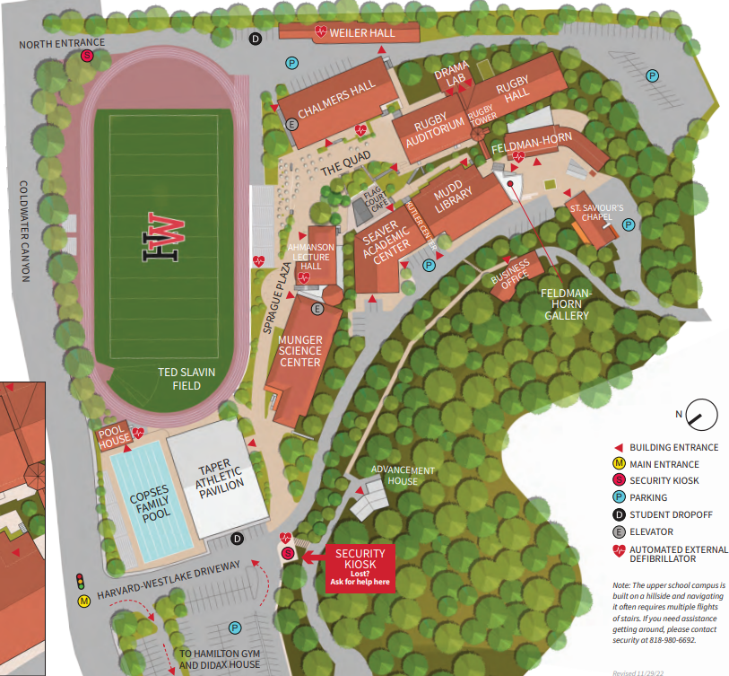

# Milo High School Game Overview

## Notice Before Game Creation (For Legal Reasons)
Real students and teachers should not be represented in this game.

## Game Overview
In my game, users will play as students or teachers at a High School. The objective of the students is to evacuate the school and leave early, while the teachers try to keep them in the school.

- Matches will have 10-20 players and will last around 10-20 minutes.
- There should be far fewer teachers than students, with around a 1:5 teacher-to-student ratio.

Students can evacuate the school in limitless ways, but solutions to escape the school should need to be pretty creative to work.

- However, the teachers do not want the students to leave.
- They try to find students' schemes (so schemes should take a while and should be easy to spot) and send students to the office if they get caught.
- If a teacher is abusing their tools, however, they too will get sent to the office.

## Items
Students and teachers should be able to collect items in an inventory throughout the game. This can include permitted items, like computers or school supplies, or forbidden items, like knives, paint, explosives, or anything else they can get their hands on.

Teachers try to prevent students from accessing prohibited items during the game and can confiscate items they find.

- Items should also be able to be altered in rooms like the science room, robotics room, or the art rooms to create new prohibited items.
- An example of this is turning a ruler or pencil into a knife or taking chemistry items to turn them into different explosives or chemicals.

## Map
The game should feature a moderately accurate 2D model of the HW upper school.

- Interactives can be found across the entire map, including school supplies, food, power terminals, gas lines, doors, school vehicles, lights, whiteboards, and much more.
- These interactives would change the map for everyone, so whiteboards can be seen by everyone, teachers could investigate open doors, multiple people could get into vechicles, gas lines would cause rooms to light on fire, power sockets let people use power tools, etc.
- Having as many interactions with the map is essential to make this game engaging.

Some aspects of the game should also be randomly generated.
- For instance, the items within a teacher's desk should change between games.

People should be able to go into buildings but not see into buildings while outside.

## Students
Students have assignments that they need to complete, which justifies them taking certain supplies out of rooms.

- Completing assignments may allow them to cash in school credit for more interesting supplies, like gaining access to the back science hallway.
- However, their main objective is to evacuate the school.

They win if they can cause a disaster large enough at the school, which could include:

- Destroying a building
- Setting fire to two or more buildings
- Causing a water main break
- Shorting the power to the entire school

There should be many opportunities to destroy the school so teachers can't just camp certain map locations.

- Student health should be very low so any mistake may lead to death. They will have to be careful to not die when dealing with more dangerous items, or careful falling places. Things like electricity or fire would kill them fairly quickly.

## Teachers
Teachers are not able to destroy the school and are unable to possess forbidden items.

- However, they have several advantages over students. They should move slightly faster than students and can send students to the office.
- Students should be able to slow teachers down. Examples may include barricading a classroom, using chemicals, leaving food on the floor, glue, staples, etc.
- Teachers should have significantly more health than students (4x).
- Teachers are still player controlled.

## The Office
Students and teachers who "die" respawn in the office. Additionally, people sent to the office will end up here.

- People in the office need to wait 30 seconds before leaving, during which they have to fill out a detention slip.
- If they don't fill it out well, it doesn't matter—this just keeps them engaged during the 30-second wait.

## User Interface
All users, students and teachers, can move around using WASD on a 2D map.

- Interactables, like desks, doors, or other objects, can be interacted with using F.
- Players also get an inventory where they can hold items in their backpack. They have space to hold any item, which they can then use.
- There should also be a health bar, as user actions will remove health from other players.

## Aesthetics
This game will be a 2D pixelated game with bland colors, but interactions with the map will be incredibly bright and colorful.

- This contrast motivates users to interact more with the map.
- Teachers and students should also stand out from the background to make them easy to see.

### Sample Map

### Player Model Example

## Goal
The game aims to give players a chance to do things they've always imagined doing (like blowing up the school) with no real-life consequences. It will be a fun, competitive multiplayer game where people have to be sneaky, creative, and dramatic to win.

## Target Audience
Students or recent alumni